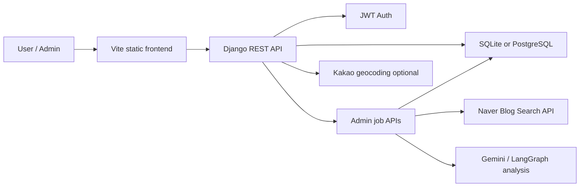
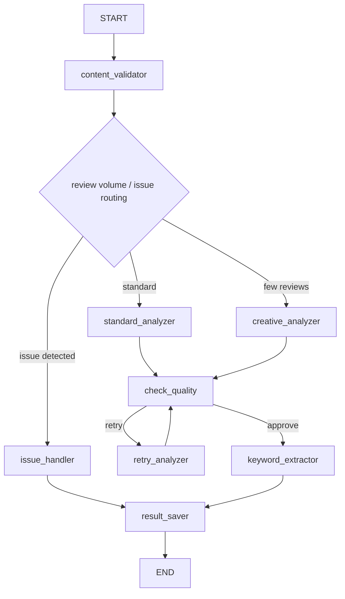

# LGRO - AI 짬뽕 맛집 지도

광고성 리뷰와 단순 별점만으로는 알기 어려운 짬뽕 맛집의 실제 매력을, 지역 데이터와 블로그 리뷰, AI 감성 분석으로 다시 정리하는 맛집 탐색 서비스입니다.

이 프로젝트는 첨부된 FestMoment 기획의 핵심 아이디어인 **공공/민간 데이터 융합 + AI 감성 분석 + 시각화**를 짬뽕 맛집 도메인에 맞게 전환한 버전입니다. 축제 평가 대신 수도권 짬뽕 맛집을 중심으로, 매장 정보와 Naver Blog 리뷰를 수집하고 Gemini/LangGraph 기반 분석 결과를 사용자 화면과 관리자 대시보드에 제공합니다.

## 주요 기능

- 지역, 국물 스타일, 맵기, 가격, 유튜브 소개 여부 기반 맛집 검색
- 맛집 상세 정보, 메뉴, 이미지, 대표 리뷰/AI 분석 결과 조회
- Naver Blog 리뷰 수집 및 광고성/저품질 리뷰 필터링
- Gemini 기반 11개 항목 감성 분석
- 국물, 맵기, 불향, 면 식감, 토핑, 양, 가격, 대기, 위생, 서비스, 재방문 의사 점수화
- 키워드 및 워드클라우드용 데이터 생성
- JWT 로그인, 회원가입, 즐겨찾기
- Q&A 커뮤니티
- 방문/검색 로그 및 인기 검색어 집계
- 관리자 대시보드에서 리뷰 수집과 AI 분석 작업 실행

## 서비스 흐름



## 기술 스택

| 영역 | 기술 |
| --- | --- |
| Backend | Python 3.11+, Django 5, Django REST Framework |
| Auth | djangorestframework-simplejwt |
| AI | LangGraph, LangChain Google GenAI, Gemini |
| Database | SQLite 개발 기본값, PostgreSQL `DATABASE_URL` 지원 |
| Frontend | Vite, HTML, JavaScript modules, Tailwind CDN |
| External APIs | Naver Blog Search API, Kakao Local API, Gemini API |
| Admin | Django Admin, 별도 `admin.html` 대시보드 |

## 프로젝트 구조

```text
LGRO/
├── backend/
│   ├── accounts/          # 사용자, JWT 인증, 관리자 권한
│   ├── restaurants/       # 지역, 맛집, 메뉴, 이미지, 즐겨찾기
│   ├── reviews/           # Naver Blog 리뷰 수집 소스
│   ├── ai_analysis/       # LangGraph 분석 파이프라인, 분석 결과, 관리자 작업 API
│   ├── analytics/         # 방문/검색 로그, 인기 검색어, 통계 API
│   ├── community/         # Q&A
│   └── config/            # Django 설정/URL
├── frontend/
│   ├── main.html          # 메인 화면
│   ├── index.html         # 검색/추천 화면
│   ├── map.html           # 지도 화면
│   ├── search_result.html # 검색 결과
│   ├── reviews.html       # 맛집 상세/리뷰 화면
│   ├── report.html        # 제보 화면
│   ├── admin.html         # 관리자 대시보드
│   └── src/               # 공통 API, 화면 연결 스크립트
├── docs/
├── PROJECT.md
├── DESIGN.md
└── README.md
```

## 데이터 모델 요약

서비스의 중심 엔티티는 `JjambbongRestaurant`입니다.

- `Region` 1:N `JjambbongRestaurant`
- `JjambbongRestaurant` 1:N `RestaurantMenu`, `RestaurantImage`
- `JjambbongRestaurant` 1:N `ReviewSource`
- `JjambbongRestaurant` 1:N `AIAnalysisResult`
- `AIAnalysisResult` 1:N `SentimentAspectScore`
- `AIAnalysisResult` 1:N `RestaurantKeyword`, `WordCloudResult`
- `User` N:M `JjambbongRestaurant` via `UserFavorite`
- `User` 1:N `Question`, `Answer`, `VisitLog`, `SearchLog`

분석 결과는 이력형으로 저장됩니다. 최신 결과는 `AIAnalysisResult.is_latest`로 구분하고, 맛집 목록 정렬용 점수는 `JjambbongRestaurant.sentiment_score`에 캐시합니다.

## 빠른 시작

### 1. 사전 준비

- Python 3.11+
- Node.js 18+
- npm
- uv 권장

### 2. 백엔드 설정

```bash
cd backend
uv sync
```

`backend/.env` 파일을 생성하고 필요한 값을 설정합니다.

```env
DJANGO_SECRET_KEY=change-me
DJANGO_DEBUG=true
DJANGO_ALLOWED_HOSTS=localhost,127.0.0.1
CORS_ALLOWED_ORIGINS=http://localhost:5173,http://127.0.0.1:5173

# 비워두면 SQLite를 사용합니다.
DATABASE_URL=

# 외부 API
GOOGLE_API_KEY=your_gemini_api_key
NAVER_CLIENT_ID=your_naver_client_id
NAVER_CLIENT_SECRET=your_naver_client_secret
KAKAO_REST_API_KEY=your_kakao_rest_api_key
VITE_KAKAO_MAP_KEY=your_kakao_map_javascript_key
```

마이그레이션과 개발용 데이터를 준비합니다.

```bash
uv run python manage.py migrate
uv run python manage.py ensure_dev_superuser
uv run python manage.py seed_sample_data
```

백엔드 서버 실행:

```bash
uv run python manage.py runserver
```

기본 API 주소는 `http://127.0.0.1:8000/api/`입니다.

### 3. 프론트엔드 설정

```bash
cd frontend
npm install
npm run dev
```

기본 프론트엔드 주소는 `http://localhost:5173/main.html`입니다.

## 주요 명령어

```bash
# 개발용 관리자 계정 생성/갱신
uv run python manage.py ensure_dev_superuser

# 샘플 지역, 맛집, 메뉴, AI 분석 결과 생성
uv run python manage.py seed_sample_data

# Naver Blog 리뷰 수집
uv run python manage.py collect_reviews --all
uv run python manage.py collect_reviews --restaurant-id <restaurant_uuid>

# AI 감성 분석 실행
uv run python manage.py run_analysis --all
uv run python manage.py run_analysis --restaurant-id <restaurant_uuid>

# 주요 API 응답 확인
uv run python manage.py verify_api_responses
```

## 관리자 대시보드

관리자 대시보드는 `frontend/admin.html`에서 제공합니다.

1. 개발용 관리자 생성
   ```bash
   cd backend
   uv run python manage.py ensure_dev_superuser
   ```
2. 백엔드와 프론트엔드 실행
3. `http://localhost:5173/admin.html` 접속
4. 관리자 계정으로 로그인
5. 리뷰 수집 또는 AI 분석 작업 실행

관리자 권한은 `accounts.User.is_service_admin`으로 판단합니다. `role == "admin"`이거나 `is_staff=True`이면 관리자 대시보드 접근이 가능합니다.

## 주요 API

### 인증

- `POST /api/auth/register/`
- `POST /api/auth/login/`
- `POST /api/auth/refresh/`
- `GET /api/auth/me/`

### 맛집

- `GET /api/regions/`
- `GET /api/restaurants/`
- `GET /api/restaurants/{id}/`
- `GET /api/restaurants/{id}/menus/`
- `GET /api/restaurants/{id}/sentiment/`
- `GET /api/restaurants/{id}/wordcloud/`
- `POST /api/restaurants/{id}/favorite/`
- `DELETE /api/restaurants/{id}/favorite/`

### 커뮤니티/통계

- `GET /api/questions/`
- `POST /api/questions/`
- `POST /api/analytics/visits/`
- `POST /api/analytics/searches/`
- `GET /api/analytics/popular-searches/`
- `GET /api/analytics/summary/`

### 관리자 작업

- `POST /api/admin/collect-reviews/`
- `POST /api/admin/run-analysis/`
- `GET /api/admin/jobs/{job_id}/`

## AI 분석 파이프라인

LangGraph 기반 분석 파이프라인은 다음 단계로 동작합니다.



핵심 설계 포인트:

- 광고성 리뷰와 저품질 리뷰를 먼저 걸러냅니다.
- 리뷰가 충분하면 일반 분석, 부족하면 보수적인 fallback 분석을 사용합니다.
- 위생/영업 중단 등 이슈성 키워드는 별도 실패/검토 상태로 저장합니다.
- LLM 출력은 11개 aspect가 모두 있는지 검증하고, 부족하면 재시도합니다.
- 분석 결과 저장 시 기존 최신 결과의 `is_latest`를 false로 바꾼 뒤 새 결과를 최신으로 저장합니다.

## 프론트엔드 화면

- `main.html`: 서비스 메인
- `index.html`: 추천/검색 진입
- `map.html`: 지도 기반 탐색
- `search_result.html`: 검색 결과 목록
- `reviews.html`: 맛집 상세 및 AI 리뷰 분석
- `report.html`: 사용자 제보
- `admin.html`: 관리자 대시보드

공통 API 클라이언트와 로그인 모달은 `frontend/src/api.js`에서 관리합니다.

## 개발 메모

- `DATABASE_URL`이 없으면 SQLite를 사용합니다.
- 운영/공유 환경에서는 PostgreSQL 사용을 권장합니다.
- 실제 외부 API 키는 `.env`에만 두고 저장소에 커밋하지 않습니다.
- 기존 문서 일부는 초기 기획 기준이므로, 구현 기준은 Django 모델과 마이그레이션을 우선합니다.
- `PROJECT_db.md`에는 초기 기획 테이블이 일부 포함되어 있으나, 현재 구현되지 않은 테이블은 README의 “확장 예정”으로만 보는 것이 좋습니다.

## 향후 개선 아이디어

- 사용자 맛집 제보 승인/반려 플로우
- 리뷰 수집 작업의 재시도/실패 이력 저장
- 분석 작업 큐를 Celery/Redis로 분리
- 지도 화면의 반경 검색과 주변 맛집 추천
- 워드클라우드 이미지 렌더링 고도화
- 관리자 통계 화면 확장

## 라이선스

현재 별도 라이선스가 명시되어 있지 않습니다. 공개/배포 전 라이선스 정책을 확정해야 합니다.
